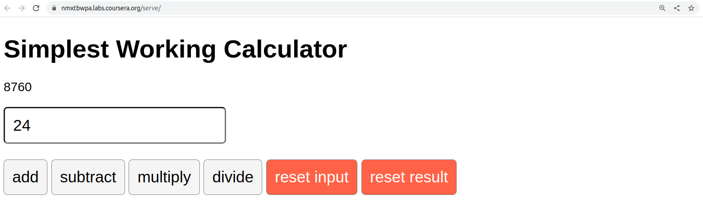

# React Basic project (part of Meta Front End Course)
- React Basic course: https://www.coursera.org/learn/react-basics
- Meta Front End Developer course: https://www.coursera.org/professional-certificates/meta-front-end-developer

## Project overview
Create a calculator app that can perform the four basic mathematical operations: addition, subtraction, multiplication, and division.

It will have a single input button, which will accept user input (any number) and a total starting with a zero.

Once a user types into the input field, they will then have to update the total by pressing any of the four math operation buttons:
    - addition 
    - subtraction 
    - multiplication 
    - division 

Here's a diagram of the completed calculator app:
